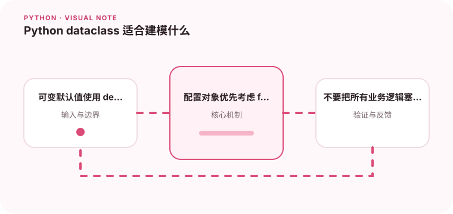

dataclass 适合减少数据对象样板代码，但复杂行为仍应由明确的类方法承载。

## 为什么值得理解

dataclass 适合表达字段明确的数据对象，自动生成初始化、比较和展示方法。它减少样板代码，但对象的业务不变量仍需要显式保护。

## 工作原理

字段按声明顺序参与构造与比较，default_factory 为每个实例创建独立可变值，frozen 阻止普通赋值。__post_init__ 可在初始化后校验或计算派生字段。

## 实战场景

订单金额值对象可以在构造时拒绝负数并规范币种；配置快照可设为 frozen。若对象有复杂状态迁移，应提供领域方法，而不是让调用方直接修改字段。

## 常见误区

最常见错误是把 [] 或 {} 作为共享默认值，或误以为 frozen 等于深度不可变。asdict 会递归复制，也可能在大对象上产生意外成本。

## 实践清单

- 可变默认值使用 default_factory。
- 配置对象优先考虑 frozen。
- 不要把所有业务逻辑塞进字段定义。
- 记录输入输出、关键假设和失败样本
- 将稳定规则沉淀为测试或自动化检查

## 动手练习

实现一个带列表字段和金额校验的 dataclass，测试两个实例是否共享默认列表。再开启 frozen，观察嵌套可变对象为何仍能改变。

## 小结

学习“Python dataclass 适合建模什么”时，先从真实输入和失败边界出发，再选择语言特性或库。保留可重复示例、测试和观察数据，才能判断方案是否真的可靠，也方便未来升级依赖或调整实现。
