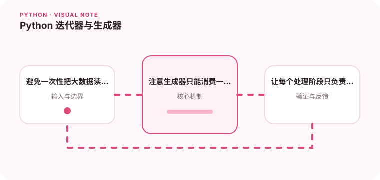

生成器让数据可以按需产生，适合处理大文件和流水线。

## 为什么值得理解

迭代器让数据按需产生，适合大文件、网络流和分阶段处理。它能降低峰值内存，也让每个转换步骤独立组合。

## 工作原理

可迭代对象通过 __iter__ 返回迭代器，迭代器用 __next__ 逐项产生值并以 StopIteration 结束。生成器函数用 yield 自动保存执行位置。

## 实战场景

处理数 GB 日志时，可以逐行读取、过滤错误记录并聚合，而不是一次性加载全部内容。每个生成器阶段只关心一种转换，便于测试和复用。

## 常见误区

生成器通常只能消费一次，调试打印或调用 list 都可能提前耗尽。延迟执行还会把文件关闭或异常发生时间推迟到真正迭代时。

## 实践清单

- 避免一次性把大数据读入内存。
- 注意生成器只能消费一次。
- 让每个处理阶段只负责一个转换。
- 记录输入输出、关键假设和失败样本
- 将稳定规则沉淀为测试或自动化检查

## 动手练习

实现一个分块读取文件并过滤记录的生成器，分别用逐项消费和 list 转换观察内存。故意迭代两次，解释第二次为何没有结果。

## 小结

学习“Python 迭代器与生成器”时，先从真实输入和失败边界出发，再选择语言特性或库。保留可重复示例、测试和观察数据，才能判断方案是否真的可靠，也方便未来升级依赖或调整实现。
