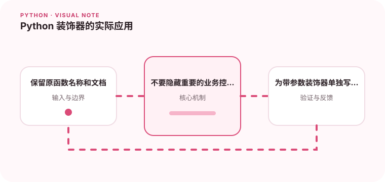

装饰器适合包装稳定的横切行为，例如计时、重试和权限检查。

## 为什么值得理解

装饰器适合为多个函数统一添加计时、重试或权限检查等横切行为。好的装饰器保持原函数契约，并让额外控制流对读者可见。

## 工作原理

装饰器本质上接收函数并返回新可调用对象。带参数装饰器再增加一层函数；functools.wraps 复制名称、文档和签名相关元数据。

## 实战场景

为外部 HTTP 查询添加只重试瞬时错误的装饰器时，应保留异常根因、限制次数并记录等待时间。业务校验失败则不应重试。

## 常见误区

不要在装饰器中悄悄吞异常或改变返回类型，也不要把依赖请求上下文的复杂逻辑隐藏在多层装饰器里。顺序不同还可能产生完全不同的行为。

## 实践清单

- 保留原函数名称和文档。
- 不要隐藏重要的业务控制流。
- 为带参数装饰器单独写测试。
- 记录输入输出、关键假设和失败样本
- 将稳定规则沉淀为测试或自动化检查

## 动手练习

实现一个可配置次数和退避时间的重试装饰器，测试成功、最终失败和不可重试异常。检查被装饰函数的 __name__ 与帮助信息是否保留。

## 小结

学习“Python 装饰器的实际应用”时，先从真实输入和失败边界出发，再选择语言特性或库。保留可重复示例、测试和观察数据，才能判断方案是否真的可靠，也方便未来升级依赖或调整实现。
