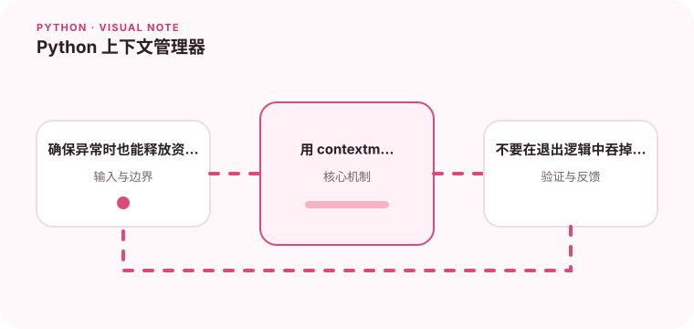

with 语句让资源释放逻辑与业务代码保持在一起。

## 为什么值得理解

上下文管理器把资源获取与释放绑定在清晰的代码块中，确保正常返回和异常退出都执行清理。文件、锁、连接和临时目录都适合这种模式。

## 工作原理

__enter__ 返回 with 块内使用的对象，__exit__ 接收异常信息并决定是否抑制。contextlib.contextmanager 则用 yield 前后代码简化小型管理器。

## 实战场景

数据库会话在进入时创建事务，在退出时按结果提交或回滚，并始终关闭连接。调用方无需在每个分支重复 try/finally。

## 常见误区

不要在 __exit__ 中无条件返回 True，否则真实异常会被吞掉。资源创建只完成一半时也必须清理已成功部分，避免连接或临时文件泄漏。

## 实践清单

- 确保异常时也能释放资源。
- 用 contextmanager 简化小型资源封装。
- 不要在退出逻辑中吞掉未处理异常。
- 记录输入输出、关键假设和失败样本
- 将稳定规则沉淀为测试或自动化检查

## 动手练习

实现一个记录耗时并管理临时文件的上下文管理器，分别测试正常完成和块内抛错。验证文件删除、异常传播和日志顺序。

## 小结

学习“Python 上下文管理器”时，先从真实输入和失败边界出发，再选择语言特性或库。保留可重复示例、测试和观察数据，才能判断方案是否真的可靠，也方便未来升级依赖或调整实现。
