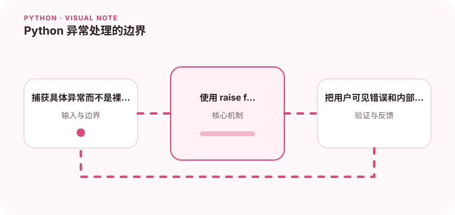

异常处理要靠近能做出决定的地方，过早捕获会丢失上下文。

## 为什么值得理解

异常应该在能够决定恢复方式的边界处理。底层保留具体原因，上层转换成业务语义，调用者才能判断重试、提示用户还是终止流程。

## 工作原理

自定义异常可形成稳定层次，raise from 保存原始异常链。finally 负责必须执行的清理，else 可把只在成功时运行的代码与捕获范围分开。

## 实战场景

导入 CSV 时，单行格式错误可以记录并继续，文件不可读则应终止整个任务。两者需要不同异常类型和统计结果，而不是统一返回 False。

## 常见误区

裸 except 会捕获 KeyboardInterrupt 等不应吞掉的信号；重复记录同一异常会产生多份堆栈。重新抛出时写 raise e 还可能改变追踪位置。

## 实践清单

- 捕获具体异常而不是裸 catch。
- 使用 raise from 保留根因。
- 把用户可见错误和内部诊断分开。
- 记录输入输出、关键假设和失败样本
- 将稳定规则沉淀为测试或自动化检查

## 动手练习

设计输入错误、外部依赖错误和内部错误三类异常，写调用层转换逻辑。验证日志只记录一次根因，用户响应不泄露路径或密钥。

## 小结

学习“Python 异常处理的边界”时，先从真实输入和失败边界出发，再选择语言特性或库。保留可重复示例、测试和观察数据，才能判断方案是否真的可靠，也方便未来升级依赖或调整实现。
