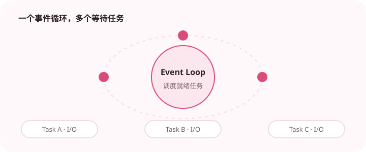

异步适合大量等待 I/O 的任务，关键是保持调用链非阻塞。

## 为什么值得理解

asyncio 适合大量任务都在等待网络或磁盘的场景，通过单线程事件循环在等待期间切换任务。它提高的是等待资源利用率，不会让 CPU 计算自动并行。

## 工作原理

async def 返回协程，create_task 将协程安排执行，await 暂停当前任务并把控制权交回事件循环。取消和超时会以异常形式沿调用链传播。

## 实战场景

并发抓取多个接口时，可以用 gather 组合任务，再用 Semaphore 限制并发，避免压垮下游。每个请求设置超时，失败结果按业务决定重试或降级。

## 常见误区

在协程中直接调用 time.sleep、同步数据库客户端或长计算会阻塞整个循环。无限创建 Task 也会造成内存与连接压力，异步并不等于无限并发。

## 实践清单

- 不要在异步函数里直接执行长时间同步阻塞。
- 为并发任务设置上限。
- 统一处理取消、超时和异常。
- 记录输入输出、关键假设和失败样本
- 将稳定规则沉淀为测试或自动化检查

## 动手练习

实现一个带并发上限的异步下载器，模拟超时、取消和部分失败。记录任务开始结束顺序，并把一个阻塞调用替换前后进行对比。

## 小结

学习“asyncio 异步编程入门”时，先从真实输入和失败边界出发，再选择语言特性或库。保留可重复示例、测试和观察数据，才能判断方案是否真的可靠，也方便未来升级依赖或调整实现。
