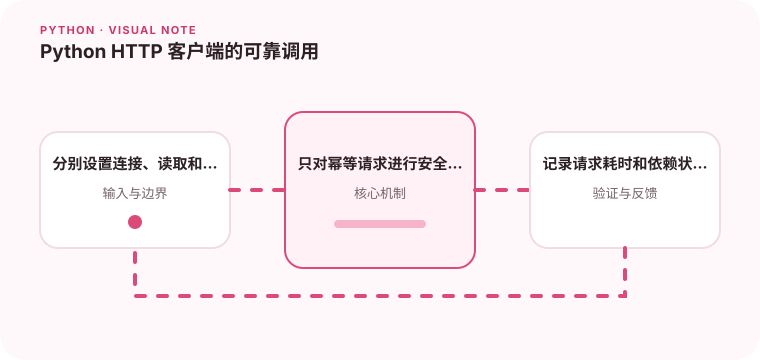

调用外部 HTTP 服务时，超时、重试和响应校验比发出请求更重要。

## 为什么值得理解

可靠的 HTTP 调用需要明确连接复用、超时、状态码、重试和响应校验。发送请求只占很小一部分，真正困难的是依赖失败时系统如何表现。

## 工作原理

Client 复用连接池，Timeout 可分别限制连接、读取、写入和池等待。raise_for_status 处理协议失败，响应 JSON 仍需按 schema 校验。

## 实战场景

查询支付状态时，可对 GET 的连接重置做有限重试，但必须设置总时间预算。若返回 200 却缺少关键字段，应视为无效响应而非继续使用默认值。

## 常见误区

不要为所有异常无限重试，POST 是否安全重试取决于幂等键。每次请求都新建客户端会失去连接复用，默认无超时则可能耗尽工作线程。

## 实践清单

- 分别设置连接、读取和总超时。
- 只对幂等请求进行安全重试。
- 记录请求耗时和依赖状态。
- 记录输入输出、关键假设和失败样本
- 将稳定规则沉淀为测试或自动化检查

## 动手练习

搭建一个随机返回慢响应、500 和错误 JSON 的本地服务，编写同步与异步客户端。验证超时分类、重试次数和最终错误信息。

## 小结

学习“Python HTTP 客户端的可靠调用”时，先从真实输入和失败边界出发，再选择语言特性或库。保留可重复示例、测试和观察数据，才能判断方案是否真的可靠，也方便未来升级依赖或调整实现。
