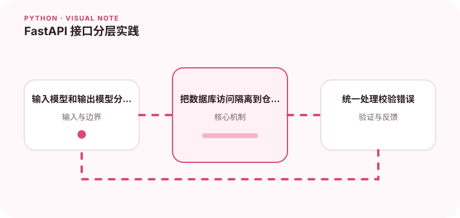

类型标注和数据模型可以让接口契约更清楚，但业务逻辑仍然需要独立组织。

## 为什么值得理解

FastAPI 借助类型标注生成接口契约和校验，但业务规则仍应与 Web 层分离。清晰分层能让用例在不启动服务器时测试，也避免数据库细节泄漏。

## 工作原理

路由负责 HTTP 参数和响应，Pydantic 模型描述边界数据，依赖系统提供认证、配置或会话，服务层执行用例。异常处理器统一映射业务失败。

## 实战场景

创建用户接口先校验邮箱格式，再由服务检查唯一性并保存。响应使用单独模型排除密码哈希，数据库会话通过依赖注入并在请求结束时关闭。

## 常见误区

不要把 ORM 实体直接作为所有响应，也不要在 async 路由里调用长时间同步 I/O。依赖函数过度嵌套会让真实调用链难以理解。

## 实践清单

- 输入模型和输出模型分别定义。
- 把数据库访问隔离到仓储或适配器。
- 统一处理校验错误。
- 记录输入输出、关键假设和失败样本
- 将稳定规则沉淀为测试或自动化检查

## 动手练习

实现一个带输入、输出模型和统一错误格式的接口，覆盖重复用户、数据库失败和非法输入。用 TestClient 验证 OpenAPI 与实际响应一致。

## 小结

学习“FastAPI 接口分层实践”时，先从真实输入和失败边界出发，再选择语言特性或库。保留可重复示例、测试和观察数据，才能判断方案是否真的可靠，也方便未来升级依赖或调整实现。
