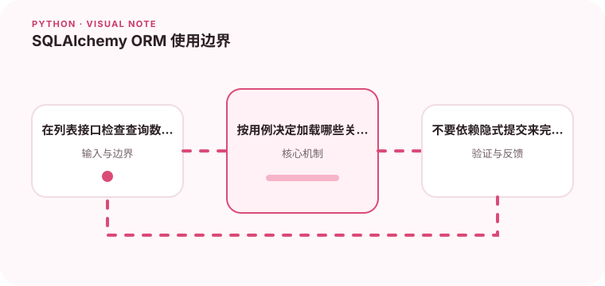

ORM 能提高开发效率，但需要理解查询生成和事务边界。

## 为什么值得理解

SQLAlchemy 提供对象与关系数据库之间的映射，但生成的 SQL、加载策略和事务仍需理解。ORM 减少样板代码，不会自动消除慢查询或一致性问题。

## 工作原理

Session 维护对象状态和事务边界，flush 把变更发送到数据库但不等于 commit。关系可懒加载或预加载，不同策略决定查询数量和返回数据量。

## 实战场景

订单列表展示客户名称时，逐条访问懒加载关系会形成 N+1。可以根据页面需求使用 selectinload，并在请求级会话内完成读取。

## 常见误区

不要跨请求长期复用 Session，也不要把 commit 隐藏在仓储的每个小方法中。发生异常后未 rollback 的会话通常无法继续安全使用。

## 实践清单

- 在列表接口检查查询数量。
- 按用例决定加载哪些关系。
- 不要依赖隐式提交来完成关键写入。
- 记录输入输出、关键假设和失败样本
- 将稳定规则沉淀为测试或自动化检查

## 动手练习

建立订单与客户关系，记录列表查询的 SQL 数量，分别测试懒加载和预加载。再制造事务失败，验证 rollback 后连接能否正常复用。

## 小结

学习“SQLAlchemy ORM 使用边界”时，先从真实输入和失败边界出发，再选择语言特性或库。保留可重复示例、测试和观察数据，才能判断方案是否真的可靠，也方便未来升级依赖或调整实现。
