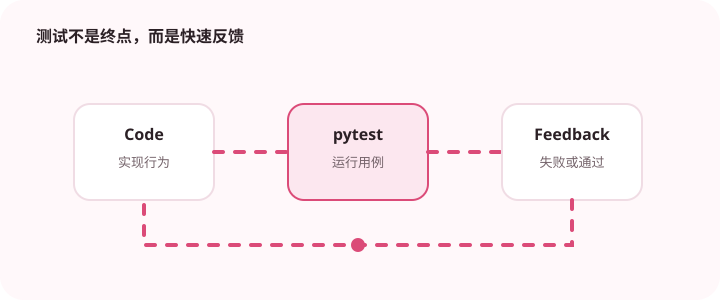

pytest 的优势在于测试表达简洁，前提是夹具边界和数据准备保持清楚。

## 为什么值得理解

pytest 让测试用普通函数表达，fixture 和参数化可以减少重复准备。测试的目标仍是稳定说明行为，夹具越隐蔽，失败时越难理解。

## 工作原理

fixture 按作用域创建和清理资源，yield 后执行回收。参数化覆盖输入矩阵，临时目录、monkeypatch 和 caplog 帮助隔离文件、环境与日志。

## 实战场景

文件解析器可用 tmp_path 生成多种输入，通过参数化覆盖编码、空文件和坏行。共享数据库夹具则应明确事务回滚，避免用例顺序相关。

## 常见误区

不要把所有对象塞进一个巨型 fixture，也不要让单元测试自动连接真实网络。过度使用 autouse 会让测试依赖难以从函数签名看出。

## 实践清单

- 夹具只提供必要资源。
- 用参数化覆盖输入矩阵。
- 单元、集成和端到端测试分开运行。
- 记录输入输出、关键假设和失败样本
- 将稳定规则沉淀为测试或自动化检查

## 动手练习

重构一组重复测试，把公共准备提成小 fixture，并用参数化合并输入矩阵。随机执行测试顺序，确认没有共享状态泄漏。

## 小结

学习“pytest 测试组织方法”时，先从真实输入和失败边界出发，再选择语言特性或库。保留可重复示例、测试和观察数据，才能判断方案是否真的可靠，也方便未来升级依赖或调整实现。
