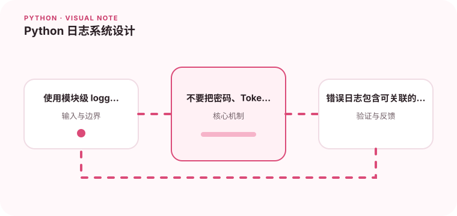

日志应该支持检索和关联，而不是只在终端打印字符串。

## 为什么值得理解

日志应让事件可检索、可关联并保护敏感数据。级别、字段和记录位置稳定后，团队才能从大量请求中快速找到一次失败的完整上下文。

## 工作原理

模块级 logger 继承统一处理器，结构化格式保存 request_id、操作名和结果。exc_info 记录堆栈，过滤器或格式器负责公共字段和脱敏。

## 实战场景

批处理失败时，应记录任务 ID、输入批次、失败阶段和异常类型；单条坏数据可以是 warning，整个任务中止才是 error，并配合指标告警。

## 常见误区

不要在每层重复打印同一异常，也不要用字符串拼接泄露 Token、密码或完整个人信息。把正常业务拒绝全部记成 error 会淹没真正故障。

## 实践清单

- 使用模块级 logger。
- 不要把密码、Token 和个人信息写入日志。
- 错误日志包含可关联的请求 ID。
- 记录输入输出、关键假设和失败样本
- 将稳定规则沉淀为测试或自动化检查

## 动手练习

为一个三层调用链传递 request_id，制造底层异常并确保只在边界记录一次堆栈。检查 JSON 日志能按字段过滤，敏感值已脱敏。

## 小结

学习“Python 日志系统设计”时，先从真实输入和失败边界出发，再选择语言特性或库。保留可重复示例、测试和观察数据，才能判断方案是否真的可靠，也方便未来升级依赖或调整实现。
