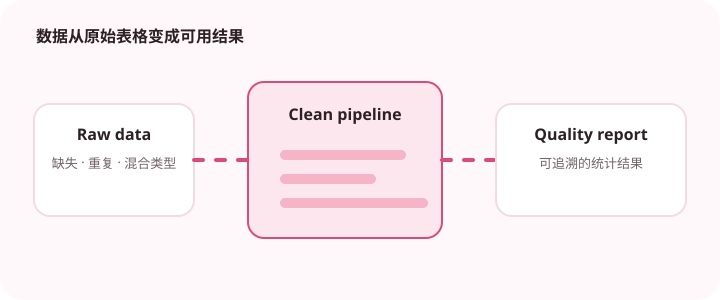

数据清洗最怕隐式修改和不可追溯，应该把每一步变换写清楚。

## 为什么值得理解

数据清洗应是可重复、可追溯的转换流水线，而不是在表格上进行无法复现的手工修改。每一步都需要明确输入、规则和输出统计。

## 工作原理

先保存原始数据，再按顺序处理类型、缺失值、重复记录和业务约束。每个阶段输出行数、异常样本与质量指标，规则则写成可测试函数。

## 实战场景

导入客户数据时，可先统一日期和手机号格式，再按业务键去重。无法确定的冲突进入隔离表人工处理，而不是静默选择第一条。

## 常见误区

不要用 fillna(0) 处理所有缺失，也不要在去重前忽略排序与保留规则。链式赋值和隐式类型转换还可能让结果与预期不一致。

## 实践清单

- 保留原始数据快照。
- 为每步清洗记录输入输出数量。
- 把业务规则写成可测试函数。
- 记录输入输出、关键假设和失败样本
- 将稳定规则沉淀为测试或自动化检查

## 动手练习

准备包含坏日期、重复键和缺失字段的小数据集，建立分阶段清洗函数。每步断言输入输出数量，并生成一份可读质量报告。

## 小结

学习“Python 数据清洗流水线”时，先从真实输入和失败边界出发，再选择语言特性或库。保留可重复示例、测试和观察数据，才能判断方案是否真的可靠，也方便未来升级依赖或调整实现。
