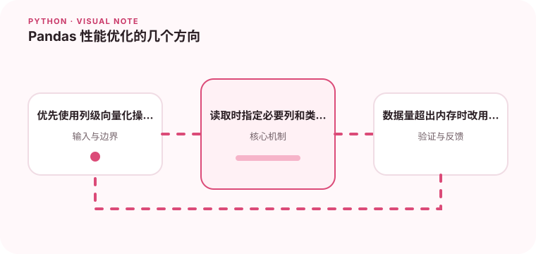

Pandas 的性能问题通常来自不必要的 Python 层循环和重复拷贝。

## 为什么值得理解

Pandas 擅长内存中的列式分析，性能关键在于减少 Python 层逐行循环、重复拷贝和不必要数据。优化前应先测量时间与峰值内存。

## 工作原理

向量化操作把计算交给底层数组实现，合适 dtype 可显著降低占用。读取时选择列、分块处理和分类类型，能避免一开始就加载全部数据。

## 实战场景

千万行 CSV 只需统计三列时，可以 usecols 和 dtype 控制读取，按块聚合后合并结果。若操作依赖逐行 apply，应先寻找可表达为列运算的方式。

## 常见误区

不要把所有代码都改成一条巨大链，也不要认为向量化永远省内存；中间数组可能同时存在。数据超过单机容量时，应改用数据库或分布式工具。

## 实践清单

- 优先使用列级向量化操作。
- 读取时指定必要列和类型。
- 数据量超出内存时改用分块或数据库。
- 记录输入输出、关键假设和失败样本
- 将稳定规则沉淀为测试或自动化检查

## 动手练习

对同一清洗任务比较 iterrows、apply 和向量化版本，记录耗时与内存。再调整 dtype 和分块大小，找到结果正确前提下的合理配置。

## 小结

学习“Pandas 性能优化的几个方向”时，先从真实输入和失败边界出发，再选择语言特性或库。保留可重复示例、测试和观察数据，才能判断方案是否真的可靠，也方便未来升级依赖或调整实现。
