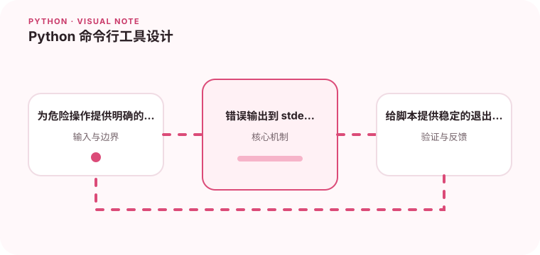

命令行工具应该让参数、错误和帮助信息都足够清楚。

## 为什么值得理解

好的命令行工具让参数、输出、错误和退出码都可预测，既方便人使用，也能安全接入脚本和 CI。帮助文本本身就是接口文档。

## 工作原理

解析层把命令行字符串转换成结构化参数，业务函数执行操作，展示层决定 stdout 或 stderr。子命令适合分组行为，配置优先级则需明确。

## 实战场景

批量导入命令可以提供 --dry-run、输入路径和格式选项。校验失败返回非零退出码并在 stderr 给出位置，正常结果则输出可供脚本解析的摘要。

## 常见误区

不要在危险操作上默认覆盖文件，也不要无论成功失败都返回 0。把业务逻辑直接写进参数回调会增加测试难度。

## 实践清单

- 为危险操作提供明确的确认机制。
- 错误输出到 stderr。
- 给脚本提供稳定的退出码。
- 记录输入输出、关键假设和失败样本
- 将稳定规则沉淀为测试或自动化检查

## 动手练习

实现一个带子命令、--dry-run 和明确退出码的小工具。用 subprocess 测试帮助、正常输出、非法参数与部分失败，确认 stdout/stderr 分工。

## 小结

学习“Python 命令行工具设计”时，先从真实输入和失败边界出发，再选择语言特性或库。保留可重复示例、测试和观察数据，才能判断方案是否真的可靠，也方便未来升级依赖或调整实现。
