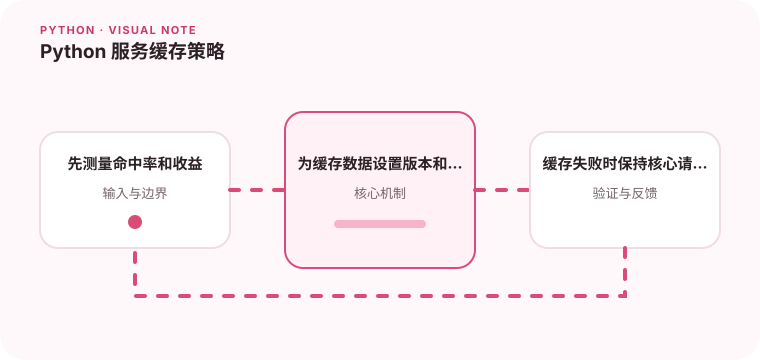

缓存应当服务于明确的热点访问，而不是替代正确的数据模型。

## 为什么值得理解

缓存应针对明确热点和延迟目标设计，同时接受数据可能短暂陈旧。命中率、重建成本和失效方式共同决定它是否真正改善系统。

## 工作原理

本地缓存延迟低但实例间不共享，Redis 等远程缓存便于统一管理。cache-aside 在未命中时读取数据源并回填，TTL 限制陈旧时间。

## 实战场景

配置读取频繁且变化较少，可使用短 TTL 本地缓存；跨实例共享的商品详情则放在 Redis，并在更新时删除对应键。

## 常见误区

不要缓存无界用户输入，也不要让缓存成为唯一数据源。相同 TTL 会造成集中失效，热点重建若无并发保护会瞬间压垮下游。

## 实践清单

- 先测量命中率和收益。
- 为缓存数据设置版本和过期时间。
- 缓存失败时保持核心请求可用。
- 记录输入输出、关键假设和失败样本
- 将稳定规则沉淀为测试或自动化检查

## 动手练习

为一个慢查询加入缓存，统计命中率与 P95。模拟缓存故障、批量过期和数据更新，验证系统能降级且不会返回跨租户数据。

## 小结

学习“Python 服务缓存策略”时，先从真实输入和失败边界出发，再选择语言特性或库。保留可重复示例、测试和观察数据，才能判断方案是否真的可靠，也方便未来升级依赖或调整实现。
