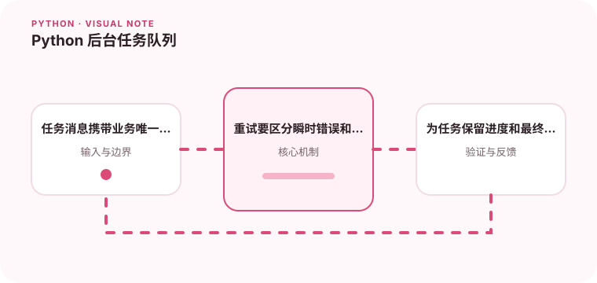

耗时任务放到后台可以改善接口响应，但任务状态和失败重试必须可见。

## 为什么值得理解

后台任务队列把耗时工作与请求响应解耦，但也引入重复执行、重试、进度和最终一致性问题。任务必须像公开接口一样拥有稳定契约。

## 工作原理

生产者提交业务键和必要参数，消费者获取任务并记录状态。重试策略区分瞬时与永久错误，幂等处理确保重复消息不会造成重复副作用。

## 实战场景

生成报表时，接口只创建任务并返回 ID，工作进程分阶段处理，用户轮询状态。存储中保留进度、结果地址和失败原因，便于恢复。

## 常见误区

不要把巨大二进制直接放进消息，也不要无限重试确定性错误。仅显示“处理中”而无更新时间，会让卡死任务无法被发现。

## 实践清单

- 任务消息携带业务唯一键。
- 重试要区分瞬时错误和永久错误。
- 为任务保留进度和最终状态。
- 记录输入输出、关键假设和失败样本
- 将稳定规则沉淀为测试或自动化检查

## 动手练习

实现一个可重复投递的报表任务，模拟 worker 宕机和第三方超时。验证幂等键、指数退避、死信记录与任务状态转换。

## 小结

学习“Python 后台任务队列”时，先从真实输入和失败边界出发，再选择语言特性或库。保留可重复示例、测试和观察数据，才能判断方案是否真的可靠，也方便未来升级依赖或调整实现。
