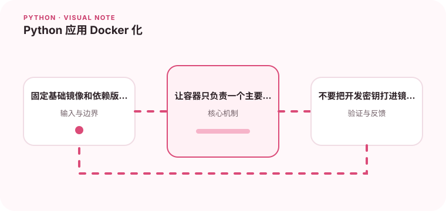

可复现的 Python 镜像需要稳定依赖、合理缓存和清晰的启动命令。

## 为什么值得理解

Python 应用容器化需要保证解释器、系统库和依赖可重复，同时让进程正确处理信号和健康检查。镜像越明确，环境差异越少。

## 工作原理

多阶段构建可在构建阶段编译 wheel，在运行阶段只保留必要文件。依赖清单单独复制有利于缓存，非 root 用户和只读文件系统降低风险。

## 实战场景

部署 FastAPI 时，用固定基础镜像安装锁定依赖，入口启动单一服务器进程。就绪检查确认依赖可用，终止信号触发连接清理。

## 常见误区

不要把 .env、缓存和虚拟环境复制进镜像，也不要用 latest 作为不可追踪基础。容器内多个守护进程会让生命周期和日志管理复杂化。

## 实践清单

- 固定基础镜像和依赖版本。
- 让容器只负责一个主要进程。
- 不要把开发密钥打进镜像层。
- 记录输入输出、关键假设和失败样本
- 将稳定规则沉淀为测试或自动化检查

## 动手练习

构建一个分层、非 root 的镜像，比较修改源码前后的缓存命中。限制内存并发送 SIGTERM，确认应用能优雅退出且没有遗留临时文件。

## 小结

学习“Python 应用 Docker 化”时，先从真实输入和失败边界出发，再选择语言特性或库。保留可重复示例、测试和观察数据，才能判断方案是否真的可靠，也方便未来升级依赖或调整实现。
