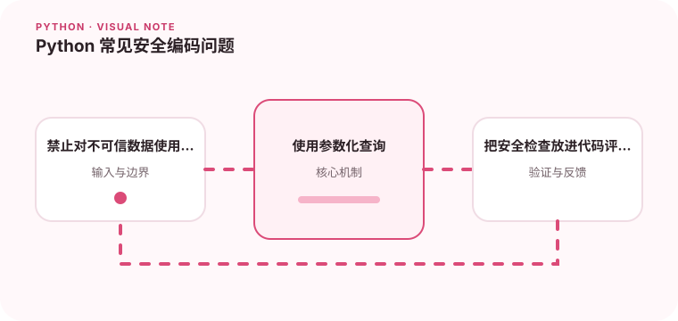

动态语言的灵活性不能代替输入校验、权限控制和安全默认值。

## 为什么值得理解

Python 安全编码的重点是把外部输入视为数据，并通过安全 API 处理，而不是拼成 SQL、命令、模板或对象代码。权限检查必须位于服务端边界。

## 工作原理

参数化查询把 SQL 结构与值分开，subprocess 参数列表避免 shell 解释，安全序列化格式不执行任意对象。模板默认转义能降低 XSS 风险。

## 实战场景

导出接口接收筛选条件时，应把字段映射到允许列表并参数化值；文件转换工具则用固定程序和参数数组，不把用户输入传给 shell=True。

## 常见误区

eval、pickle 和 yaml.load 等危险能力不应处理不可信数据。仅靠正则过滤特殊字符也很脆弱，因为不同解释器和编码会产生绕过。

## 实践清单

- 禁止对不可信数据使用危险反序列化。
- 使用参数化查询。
- 把安全检查放进代码评审和自动化扫描。
- 记录输入输出、关键假设和失败样本
- 将稳定规则沉淀为测试或自动化检查

## 动手练习

审查一个包含 SQL 拼接、shell=True 和 pickle 的示例，逐项替换为安全接口。补充恶意输入测试，并运行依赖与静态安全扫描。

## 小结

学习“Python 常见安全编码问题”时，先从真实输入和失败边界出发，再选择语言特性或库。保留可重复示例、测试和观察数据，才能判断方案是否真的可靠，也方便未来升级依赖或调整实现。
