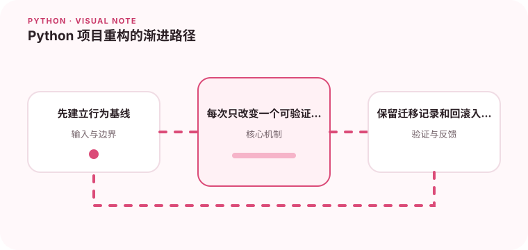

重构的目标是降低修改成本，而不是一次性追求理想结构。

## 为什么值得理解

渐进重构在保持行为可验证的前提下改善结构。先找高频变化和故障边界，再逐步提取职责，比一次性重写更容易控制风险。

## 工作原理

特征测试记录现有行为，适配层隔离外部依赖，之后才能移动逻辑、调整接口并删除旧路径。每一步都应保持可运行和可回滚。

## 实战场景

一个把解析、数据库和 HTTP 调用混在同一函数的项目，可先固定输入输出测试，再提取纯解析函数和网关接口，最后替换存储实现。

## 常见误区

不要在没有基线时同时改结构与业务规则，也不要留下永久双轨逻辑。为了追求理想目录而制造大量空转发层，同样会增加维护成本。

## 实践清单

- 先建立行为基线。
- 每次只改变一个可验证的边界。
- 保留迁移记录和回滚入口。
- 记录输入输出、关键假设和失败样本
- 将稳定规则沉淀为测试或自动化检查

## 动手练习

选择一个最难测试的模块，先补特征测试，再连续做三次小重构，每次独立提交并运行测试。记录哪条边界让后续修改最明显变简单。

## 小结

学习“Python 项目重构的渐进路径”时，先从真实输入和失败边界出发，再选择语言特性或库。保留可重复示例、测试和观察数据，才能判断方案是否真的可靠，也方便未来升级依赖或调整实现。
