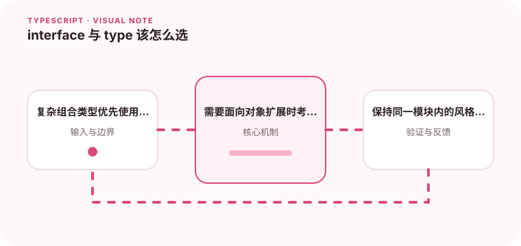

两者都能描述对象结构，选择应服务于扩展方式和团队约定。

## 为什么值得理解

interface 与 type 都能描述对象，但它们的扩展方式和语义侧重点不同。统一团队约定比争论唯一答案更重要，选择应让类型意图容易理解。

## 工作原理

interface 支持声明合并和 extends，适合可扩展对象契约；type 能表达联合、元组、映射和条件类型。两者都遵循结构兼容，也都能组合对象成员。

## 实战场景

公共组件 Props 可以用 interface 方便继承原生属性，状态结果用 type 联合表达 loading、success 与 error。使用者一眼就能看出类型是开放对象还是有限集合。

## 常见误区

不要通过声明合并无意改变第三方类型，也不要为了统一全部改成一种写法。复杂交叉类型可能产生难懂错误，重复字段冲突也需要显式处理。

## 实践清单

- 复杂组合类型优先使用 type。
- 需要面向对象扩展时考虑 interface。
- 保持同一模块内的风格一致。
- 让静态类型与真实运行时数据保持一致
- 将关键约束纳入类型检查和自动化测试

## 动手练习

分别用 interface 和 type 建模组件属性、事件结果与元组，尝试扩展和联合。记录哪种写法对调用方最清楚，并形成项目约定。

## 小结

学习“interface 与 type 该怎么选”时，类型只是表达约束的工具。只有把运行时校验、状态变化和实际构建结果一起验证，才能真正降低错误率，并让类型在需求演进中持续帮助团队。
