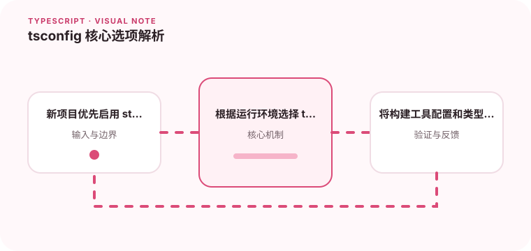

编译配置决定了项目的安全边界、模块行为和开发体验。

## 为什么值得理解

tsconfig 决定编译器检查强度、模块解析和输出目标，是项目类型安全的基础设施。配置应与真实运行环境和构建工具职责一致。

## 工作原理

strict 打开一组关键检查，target 决定输出语法，module 与 moduleResolution 控制导入解析，lib 描述可用平台 API。noEmit 可让构建工具负责产物。

## 实战场景

浏览器项目由 Vite 打包时，可让 tsc 只做类型检查，moduleResolution 选择 bundler；Node 服务则要与运行时 ESM 或 CommonJS 规则对齐。

## 常见误区

不要从网上复制整份配置却不了解继承关系，也不要用 skipLibCheck 长期掩盖依赖冲突。include 过宽会把脚本和生成文件意外纳入检查。

## 实践清单

- 新项目优先启用 strict。
- 根据运行环境选择 target。
- 将构建工具配置和类型检查职责分开。
- 让静态类型与真实运行时数据保持一致
- 将关键约束纳入类型检查和自动化测试

## 动手练习

从最小配置开始逐项启用 strict、noUncheckedIndexedAccess 等选项，记录出现的真实缺陷。检查编译输出是否匹配目标浏览器或 Node 版本。

## 小结

学习“tsconfig 核心选项解析”时，类型只是表达约束的工具。只有把运行时校验、状态变化和实际构建结果一起验证，才能真正降低错误率，并让类型在需求演进中持续帮助团队。
