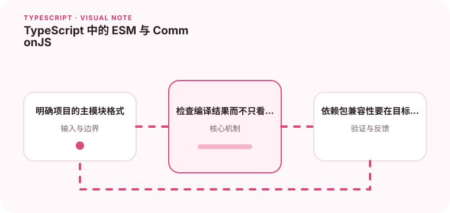

模块系统混用时，导入导出和运行时解析经常出现隐蔽错误。

## 为什么值得理解

ESM 与 CommonJS 的差异不仅是 import 和 require 写法，还涉及文件识别、解析时机、默认导出和运行时环境。混用时错误常在部署后才出现。

## 工作原理

Node 根据 package.json 的 type、文件扩展名和条件导出判断模块格式。ESM 静态导入支持分析，CommonJS 在运行时执行 require；两种互操作存在默认值包装差异。

## 实战场景

库同时服务 Node 与打包器时，应通过 exports 明确 import、require 和 types 入口，并实际测试两套消费方式，而不是只检查 TypeScript 源码。

## 常见误区

不要随意改 type 为 module 后期待旧脚本继续工作，也不要省略 ESM 相对导入扩展名。编译器模块配置与 Node 运行规则不一致会产生“能编译不能运行”。

## 实践清单

- 明确项目的主模块格式。
- 检查编译结果而不只看源码。
- 依赖包兼容性要在目标运行时验证。
- 让静态类型与真实运行时数据保持一致
- 将关键约束纳入类型检查和自动化测试

## 动手练习

创建一个最小库，分别由 ESM 和 CommonJS 项目消费。检查默认导出、命名导出、动态导入和类型声明是否都指向正确文件。

## 小结

学习“TypeScript 中的 ESM 与 CommonJS”时，类型只是表达约束的工具。只有把运行时校验、状态变化和实际构建结果一起验证，才能真正降低错误率，并让类型在需求演进中持续帮助团队。
