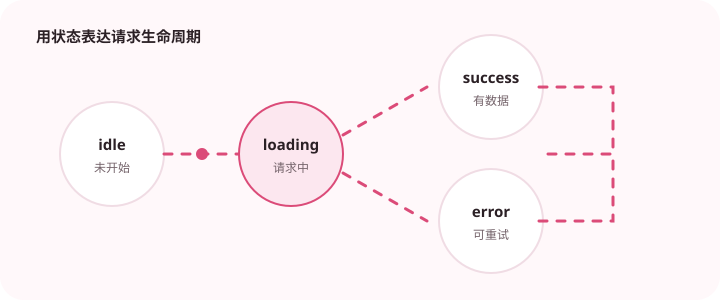

接口类型应该来自明确契约，不能只在调用处凭感觉补字段。

## 为什么值得理解

API 类型是前后端之间的契约，不应等同于页面内部模型。明确请求、响应、错误和空值语义，能减少接口升级后的隐蔽兼容问题。

## 工作原理

DTO 描述线上数据格式，解析层进行运行时校验并转换成领域或视图模型。nullable 表示明确空值，optional 表示字段可能缺失，两者不能混用。

## 实战场景

用户接口返回日期字符串，前端解析后再生成 Date 或展示文本。若后端新增可选头像字段，旧客户端仍可工作；改变已有字段单位则属于破坏性变更。

## 常见误区

不要根据一次响应手写一个过窄类型，也不要把所有字段设为可选来“兼容”。只共享 TypeScript 类型而没有运行时契约，仍无法防止服务端漂移。

## 实践清单

- 区分 API DTO 和页面展示模型。
- 对 nullable 和 optional 做不同表达。
- 接口变更配合契约测试或生成工具。
- 让静态类型与真实运行时数据保持一致
- 将关键约束纳入类型检查和自动化测试

## 动手练习

为一个接口分别定义请求、响应、错误和视图模型，加入 schema 校验。模拟字段缺失、null 和新字段，验证兼容策略与错误提示。

## 小结

学习“前端 API 类型如何维护”时，类型只是表达约束的工具。只有把运行时校验、状态变化和实际构建结果一起验证，才能真正降低错误率，并让类型在需求演进中持续帮助团队。
