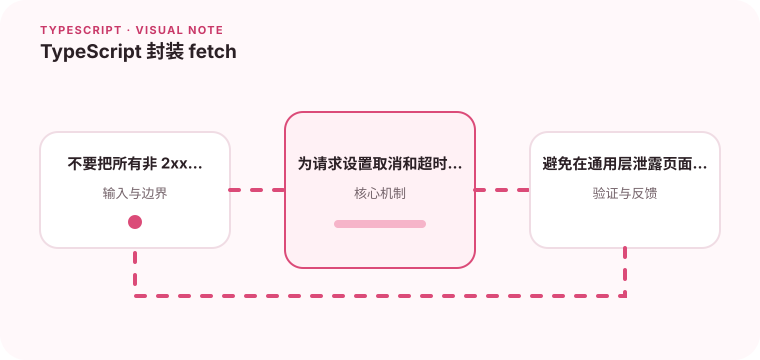

HTTP 封装的重点是统一超时、错误、解析和认证行为。

## 为什么值得理解

fetch 封装应统一超时、取消、认证、响应解析和错误模型，同时保持业务语义在调用层。封装过薄会重复代码，过厚则隐藏重要控制流。

## 工作原理

fetch 只在网络故障时 reject，HTTP 404 或 500 仍是正常 Response。AbortController 负责取消，Content-Type 决定解析方式，泛型不能替代实际响应校验。

## 实战场景

搜索请求随输入变化时，可取消前一次请求，避免旧结果覆盖新结果。401 由认证层统一处理，业务冲突则解析为可展示的领域错误。

## 常见误区

不要默认 response.json 一定成功，也不要对所有 POST 自动重试。全局拦截器若静默刷新令牌或跳转，可能造成循环和难以追踪的状态变化。

## 实践清单

- 不要把所有非 2xx 都当成网络错误。
- 为请求设置取消和超时机制。
- 避免在通用层泄露页面状态。
- 让静态类型与真实运行时数据保持一致
- 将关键约束纳入类型检查和自动化测试

## 动手练习

实现带总超时、取消和结构化错误的请求函数，模拟 204、错误 JSON、401 与慢响应。验证调用方能区分网络、协议和业务错误。

## 小结

学习“TypeScript 封装 fetch”时，类型只是表达约束的工具。只有把运行时校验、状态变化和实际构建结果一起验证，才能真正降低错误率，并让类型在需求演进中持续帮助团队。
