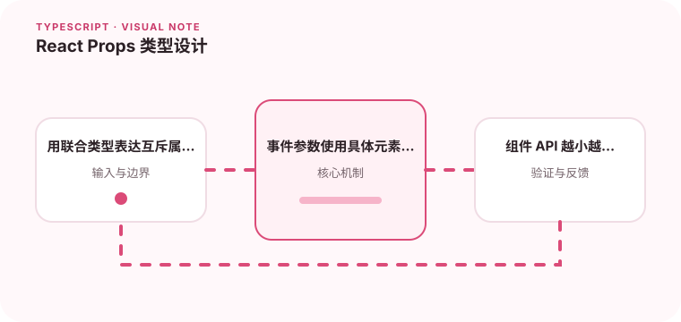

Props 类型应体现组件的使用方式，而不是把所有字段都设成可选。

## 为什么值得理解

Props 是组件对外 API，类型应表达哪些组合合法、哪些字段互斥。把所有属性设成可选会把错误推到组件内部，并产生大量默认分支。

## 工作原理

普通必选属性直接声明，互斥模式可用判别联合，事件回调使用具体参数类型。ComponentPropsWithoutRef 能复用原生元素属性并保留正确事件。

## 实战场景

按钮组件可分为 href 模式和 onClick 模式，联合类型禁止同时缺失或同时提供关键字段。调用方获得准确提示，组件内部也能按判别字段收窄。

## 常见误区

不要用 React.FC 解决所有 children 问题，也不要把 DOM 事件写成 any。Props 继承过多原生属性可能暴露组件不支持的行为。

## 实践清单

- 用联合类型表达互斥属性。
- 事件参数使用具体元素类型。
- 组件 API 越小越容易复用。
- 让静态类型与真实运行时数据保持一致
- 将关键约束纳入类型检查和自动化测试

## 动手练习

设计一个链接按钮和加载按钮，使用联合类型限制属性组合。写类型测试确认非法调用无法编译，并验证 ref 与事件元素类型。

## 小结

学习“React Props 类型设计”时，类型只是表达约束的工具。只有把运行时校验、状态变化和实际构建结果一起验证，才能真正降低错误率，并让类型在需求演进中持续帮助团队。
