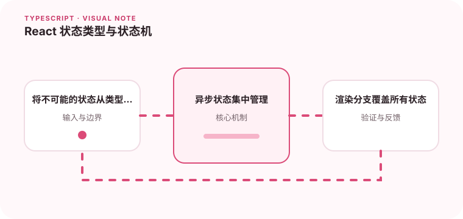

复杂 UI 状态用一堆布尔值描述时，很容易出现互相矛盾的组合。

## 为什么值得理解

UI 状态应排除不可能组合。多个布尔值容易出现同时 loading 和 success，判别联合或状态机能把状态与该状态专属数据绑定。

## 工作原理

状态对象使用 status 字段区分 idle、loading、success 和 error。reducer 根据事件转换状态，渲染分支通过 switch 获得穷尽检查。

## 实战场景

页面加载用户资料时，success 状态必须带 data，error 状态必须带 message。开始新请求会进入 loading，旧错误不再残留在界面。

## 常见误区

不要用 isLoading、hasError、data 三个独立 state 描述同一流程，也不要在 effect 中重复保存可推导状态。异步响应还要防止旧请求覆盖新结果。

## 实践清单

- 将不可能的状态从类型层排除。
- 异步状态集中管理。
- 渲染分支覆盖所有状态。
- 让静态类型与真实运行时数据保持一致
- 将关键约束纳入类型检查和自动化测试

## 动手练习

把一个多布尔状态组件改成 reducer 与判别联合，加入请求取消和重试。新增 paused 状态，观察编译器能否指出遗漏渲染。

## 小结

学习“React 状态类型与状态机”时，类型只是表达约束的工具。只有把运行时校验、状态变化和实际构建结果一起验证，才能真正降低错误率，并让类型在需求演进中持续帮助团队。
