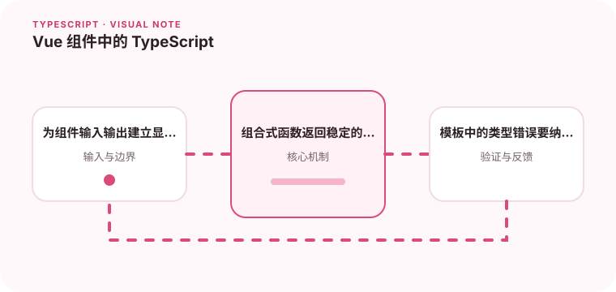

Vue 的类型安全依赖于 props、emits、模板引用和组合式函数的边界。

## 为什么值得理解

Vue 与 TypeScript 配合时，组件输入、事件、模板引用和组合式函数都能获得契约检查。类型越靠近边界，模板中的错误越早暴露。

## 工作原理

defineProps 描述输入，defineEmits 限制事件名称与参数，ref 保存响应式值，computed 推导结果。泛型 composable 可保留调用方数据类型。

## 实战场景

分页表格组件接收列定义与行数据，事件返回选中行的具体类型。模板 ref 在挂载前可能为 null，因此访问 DOM 前需要显式处理生命周期。

## 常见误区

不要大量使用 as 绕过模板报错，也不要解构 props 后丢失响应性。把所有状态装进 reactive 大对象会让可选字段和更新来源变得模糊。

## 实践清单

- 为组件输入输出建立显式契约。
- 组合式函数返回稳定的对象结构。
- 模板中的类型错误要纳入 CI 检查。
- 让静态类型与真实运行时数据保持一致
- 将关键约束纳入类型检查和自动化测试

## 动手练习

实现一个泛型列表 composable 和带类型事件的组件，运行 vue-tsc 检查模板。故意传错事件参数，确认 CI 能捕获。

## 小结

学习“Vue 组件中的 TypeScript”时，类型只是表达约束的工具。只有把运行时校验、状态变化和实际构建结果一起验证，才能真正降低错误率，并让类型在需求演进中持续帮助团队。
