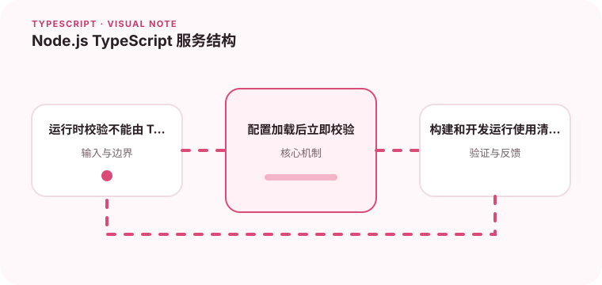

服务端 TypeScript 项目需要同时处理类型检查、运行时执行和构建产物。

## 为什么值得理解

Node.js TypeScript 服务需要同时管理运行时输入、异步资源、模块格式和构建产物。静态类型只覆盖源码，配置与请求仍需在启动和边界处校验。

## 工作原理

入口负责加载并验证配置，路由解析协议，服务层执行用例，适配器访问数据库或外部 API。编译阶段生成 JS 与声明或 sourcemap，运行阶段只依赖产物。

## 实战场景

启动服务前验证端口、数据库 URL 和密钥格式，失败就立即退出。请求通过 schema 解析后进入服务，统一错误中间件决定状态码与日志字段。

## 常见误区

不要在模块顶层创建无法关闭的连接，也不要让 ts-node 的开发行为替代生产构建验证。未处理 Promise 拒绝和悬空异步任务会造成数据丢失。

## 实践清单

- 运行时校验不能由 TypeScript 类型替代。
- 配置加载后立即校验。
- 构建和开发运行使用清晰的命令区分。
- 让静态类型与真实运行时数据保持一致
- 将关键约束纳入类型检查和自动化测试

## 动手练习

搭建一个带配置校验、健康检查和优雅停机的最小服务。构建后只用 dist 与生产依赖运行，确认 sourcemap 能定位源码。

## 小结

学习“Node.js TypeScript 服务结构”时，类型只是表达约束的工具。只有把运行时校验、状态变化和实际构建结果一起验证，才能真正降低错误率，并让类型在需求演进中持续帮助团队。
