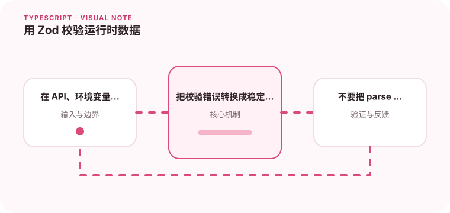

静态类型在代码运行后会消失，外部输入仍然需要运行时解析。

## 为什么值得理解

Zod 把运行时校验与 TypeScript 类型推导连接起来，适合 API、环境变量和存储数据边界。解析成功后的值才值得被业务代码信任。

## 工作原理

schema 描述字段、联合和转换，parse 失败抛出详细错误，safeParse 返回可分支结果。infer 从 schema 得到静态类型，避免手写声明漂移。

## 实战场景

读取环境变量时，可以把端口字符串转换为数字并限制范围；接口响应则用判别联合 schema，错误路径映射成稳定客户端提示。

## 常见误区

不要用 transform 隐藏无效数据，也不要在 schema 与单独 interface 之间维护两份事实。passthrough 或 strip 的选择会影响未知字段安全性。

## 实践清单

- 在 API、环境变量和消息边界校验。
- 把校验错误转换成稳定的错误格式。
- 不要把 parse 失败静默转换成默认值。
- 让静态类型与真实运行时数据保持一致
- 将关键约束纳入类型检查和自动化测试

## 动手练习

为配置和 API 响应创建 schema，覆盖缺失、错类型和未知字段。修改 schema 后检查推导类型与错误格式是否同步变化。

## 小结

学习“用 Zod 校验运行时数据”时，类型只是表达约束的工具。只有把运行时校验、状态变化和实际构建结果一起验证，才能真正降低错误率，并让类型在需求演进中持续帮助团队。
