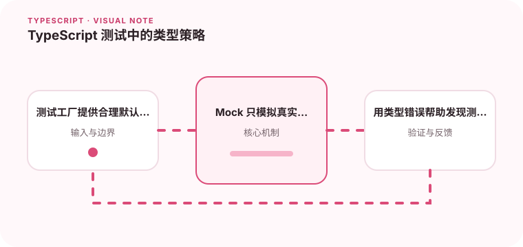

测试代码同样需要保持类型约束，否则测试可能验证一个不存在的调用方式。

## 为什么值得理解

TypeScript 测试代码也应接受类型检查，否则 Mock 和测试数据可能调用不存在的接口。测试工厂与类型约束能降低模型升级后的维护成本。

## 工作原理

测试工厂提供有效默认对象，并允许覆盖当前用例关注字段。Mock 使用真实接口或工具类型限制形状，运行时测试再验证行为和副作用。

## 实战场景

订单模型新增必填币种时，统一工厂会在编译期提醒更新；如果每个测试都用 as Order 拼对象，缺字段可能直到生产代码访问才暴露。

## 常见误区

不要把 Partial 当作所有测试数据类型，也不要用 as unknown as 绕过错误。过度精确验证内部调用会削弱重构能力。

## 实践清单

- 测试工厂提供合理默认值。
- Mock 只模拟真实存在的接口。
- 用类型错误帮助发现测试与实现的漂移。
- 让静态类型与真实运行时数据保持一致
- 将关键约束纳入类型检查和自动化测试

## 动手练习

为一个领域对象建立类型安全工厂，删除所有双重断言。升级接口字段后观察受影响测试，并保留真正说明业务行为的失败。

## 小结

学习“TypeScript 测试中的类型策略”时，类型只是表达约束的工具。只有把运行时校验、状态变化和实际构建结果一起验证，才能真正降低错误率，并让类型在需求演进中持续帮助团队。
