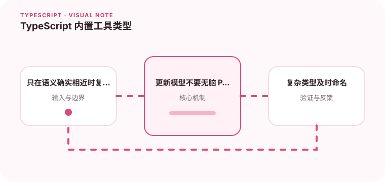

Partial、Pick、Omit 和 Record 能减少重复定义，但也可能掩盖领域差异。

## 为什么值得理解

内置工具类型能从已有类型派生新视图，减少重复声明。但它们只做结构变换，不一定保留业务语义，使用时要确认新类型真的成立。

## 工作原理

Pick 选择字段，Omit 排除字段，Partial 将属性设为可选，Required 反向处理，Record 构造键值映射。映射类型还能进一步控制 readonly 与可选修饰符。

## 实战场景

展示卡片可从完整 User 中 Pick 名称与头像；更新请求却不一定适合 Partial<User>，因为 ID 不应修改，某些字段还需要成组出现。

## 常见误区

不要层层嵌套 Omit 与交叉类型让最终形状难以阅读，也不要用 Record<string, T> 假装所有任意键都存在。复杂派生类型应命名并测试。

## 实践清单

- 只在语义确实相近时复用类型。
- 更新模型不要无脑 Partial。
- 复杂类型及时命名。
- 让静态类型与真实运行时数据保持一致
- 将关键约束纳入类型检查和自动化测试

## 动手练习

为用户展示、创建和更新分别设计类型，只在语义一致处使用工具类型。开启 noUncheckedIndexedAccess 检查映射表读取。

## 小结

学习“TypeScript 内置工具类型”时，类型只是表达约束的工具。只有把运行时校验、状态变化和实际构建结果一起验证，才能真正降低错误率，并让类型在需求演进中持续帮助团队。
