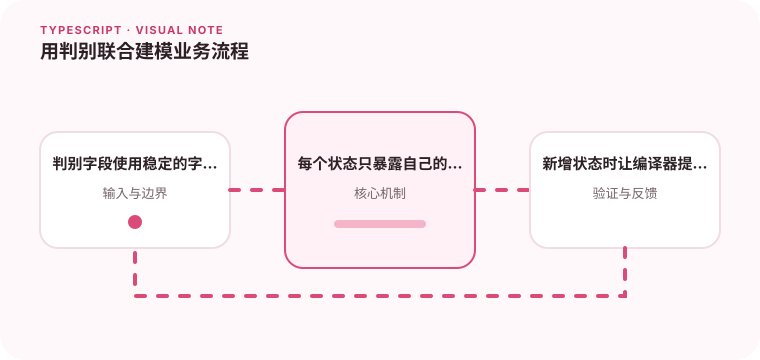

判别联合可以把状态和状态专属数据放在一起。

## 为什么值得理解

判别联合用一个稳定字面量字段区分有限状态，并让每个状态只携带自己的数据。它能让无效组合在类型层无法表达。

## 工作原理

联合成员共享 kind 或 status 字段，switch 分支后编译器自动收窄。never 检查可保证新增成员时所有处理点都被提醒。

## 实战场景

上传任务可分 queued、uploading、success 和 failure，只有 uploading 带进度，success 带 URL。界面不再需要猜测某些可选字段是否存在。

## 常见误区

不要让判别字段使用宽泛 string，也不要在所有成员放一堆 optional 字段。来自服务器的数据仍需运行时验证后才能进入联合类型。

## 实践清单

- 判别字段使用稳定的字面量。
- 每个状态只暴露自己的数据。
- 新增状态时让编译器提醒所有分支。
- 让静态类型与真实运行时数据保持一致
- 将关键约束纳入类型检查和自动化测试

## 动手练习

把一个由三个布尔值表示的流程改成判别联合，并添加穷尽函数。新增 cancelled 状态，修复编译器指出的全部遗漏。

## 小结

学习“用判别联合建模业务流程”时，类型只是表达约束的工具。只有把运行时校验、状态变化和实际构建结果一起验证，才能真正降低错误率，并让类型在需求演进中持续帮助团队。
