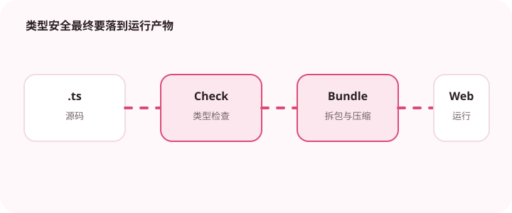

类型不会直接出现在运行时代码里，但模块组织会影响最终 Bundle。

## 为什么值得理解

TypeScript 类型会在编译后消失，但导入方式和模块副作用会影响最终 Bundle。优化应先基于分析结果，重点处理大依赖、重复代码和低频功能。

## 工作原理

tree-shaking 依赖静态 ESM 和无副作用标记，动态 import 可拆分代码块。sourcemap 帮助定位产物，Bundle 分析器展示模块体积与引用路径。

## 实战场景

富文本编辑器只在用户打开编辑页时需要，可以动态加载；日期库若只使用少量函数，应采用可摇树导入而非整包入口。

## 常见误区

不要为了几 KB 手写难维护代码，也不要把所有页面都拆成细小请求。错误的 sideEffects 配置可能删除必要初始化，压缩体积也不等于加载更快。

## 实践清单

- 先用分析工具找大模块。
- 对低频功能使用动态加载。
- 避免为了类型方便引入整个工具库。
- 让静态类型与真实运行时数据保持一致
- 将关键约束纳入类型检查和自动化测试

## 动手练习

生成构建分析报告，找出最大三个模块并追踪导入链。对一个低频功能做动态加载，比较首屏 JS、请求数和实际加载时间。

## 小结

学习“TypeScript 构建体积优化”时，类型只是表达约束的工具。只有把运行时校验、状态变化和实际构建结果一起验证，才能真正降低错误率，并让类型在需求演进中持续帮助团队。
