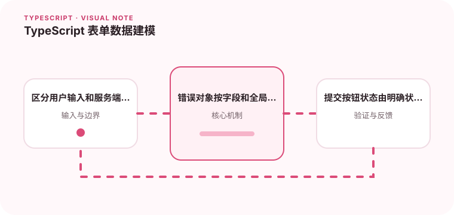

表单通常经历草稿、校验、提交和失败状态，简单对象不一定能表达这些变化。

## 为什么值得理解

表单数据会经历未触碰、编辑、校验、提交和失败等阶段。类型应区分用户原始输入、解析后的业务值和服务端错误，而不是共用一个对象。

## 工作原理

字段状态可包含 value、touched 与 error，提交状态用判别联合表示。schema 在边界把字符串转换成数字或日期，成功后再生成请求 DTO。

## 实战场景

价格输入框内部保留字符串，允许用户暂时输入空值或小数点；提交时才解析成金额并验证范围，服务器冲突则映射到字段或全局错误。

## 常见误区

不要在每次按键都把无效中间值强制转成 0，也不要用 Partial<DomainModel> 表达表单。客户端校验仍不能替代服务端验证。

## 实践清单

- 区分用户输入和服务端规范化结果。
- 错误对象按字段和全局错误分开。
- 提交按钮状态由明确状态驱动。
- 让静态类型与真实运行时数据保持一致
- 将关键约束纳入类型检查和自动化测试

## 动手练习

实现一个包含金额、日期和异步唯一性校验的表单，区分字段错误与提交错误。测试重复提交、取消请求和服务端返回旧错误。

## 小结

学习“TypeScript 表单数据建模”时，类型只是表达约束的工具。只有把运行时校验、状态变化和实际构建结果一起验证，才能真正降低错误率，并让类型在需求演进中持续帮助团队。
