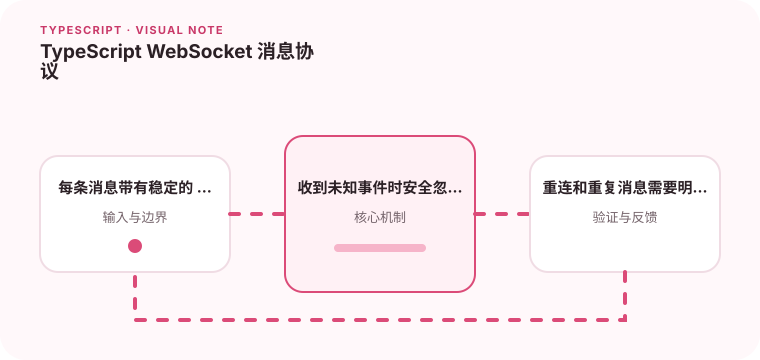

实时消息需要处理连接变化、消息版本和未知类型。

## 为什么值得理解

WebSocket 消息是长期演进的实时协议，需要处理连接中断、重复、乱序和未知事件。判别联合能让客户端对已知消息进行穷尽处理。

## 工作原理

每条消息包含稳定 type、版本和必要标识，连接层负责解析与校验，状态层处理事件。重连后可用序号或游标恢复遗漏消息。

## 实战场景

聊天系统收到 message.created、message.updated 和 presence.changed 时，各分支拥有不同 payload。未知新事件应安全记录并忽略，而不是让整个连接崩溃。

## 常见误区

不要假设连接持续可靠，也不要把 JSON.parse 后结果直接断言为联合类型。仅靠时间戳去重可能受时钟影响，心跳与重连也要有退避。

## 实践清单

- 每条消息带有稳定的 type 字段。
- 收到未知事件时安全忽略并记录。
- 重连和重复消息需要明确策略。
- 让静态类型与真实运行时数据保持一致
- 将关键约束纳入类型检查和自动化测试

## 动手练习

实现一个带运行时 schema 的消息处理器，模拟重复、乱序、未知事件和断线重连。验证状态最终一致且不会重复展示消息。

## 小结

学习“TypeScript WebSocket 消息协议”时，类型只是表达约束的工具。只有把运行时校验、状态变化和实际构建结果一起验证，才能真正降低错误率，并让类型在需求演进中持续帮助团队。
