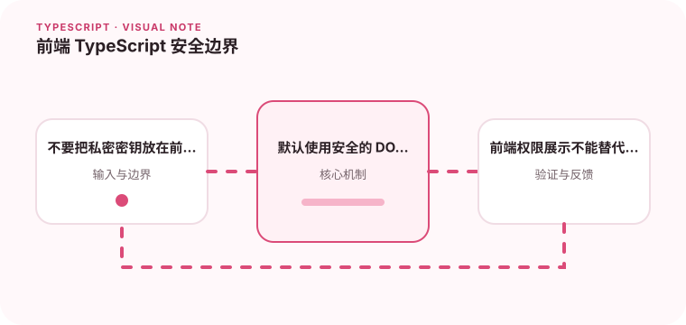

类型安全不能阻止 XSS、越权或泄露密钥，运行时安全仍然需要独立设计。

## 为什么值得理解

TypeScript 只能减少类型错误，不能阻止 XSS、越权、CSRF 或密钥泄露。安全边界依赖运行时编码、服务端鉴权和浏览器策略。

## 工作原理

不可信文本进入 DOM 前应使用安全 API，富文本需要经过可信净化。Token 存储、Cookie 属性和 CSP 决定攻击面，权限校验必须由服务端执行。

## 实战场景

评论内容作为纯文本渲染，管理按钮可根据权限隐藏，但删除请求仍由服务端验证资源与操作者。前端环境变量中只能放公开配置。

## 常见误区

不要使用 innerHTML 拼接用户内容，也不要把私密 API Key 打进 Bundle。客户端路由守卫只能改善体验，不能成为真正授权控制。

## 实践清单

- 不要把私密密钥放在前端包里。
- 默认使用安全的 DOM API。
- 前端权限展示不能替代服务端鉴权。
- 让静态类型与真实运行时数据保持一致
- 将关键约束纳入类型检查和自动化测试

## 动手练习

为一个富文本展示页加入恶意 payload 测试，检查 CSP 和净化结果。直接调用受限 API，确认服务端能拒绝越权请求。

## 小结

学习“前端 TypeScript 安全边界”时，类型只是表达约束的工具。只有把运行时校验、状态变化和实际构建结果一起验证，才能真正降低错误率，并让类型在需求演进中持续帮助团队。
